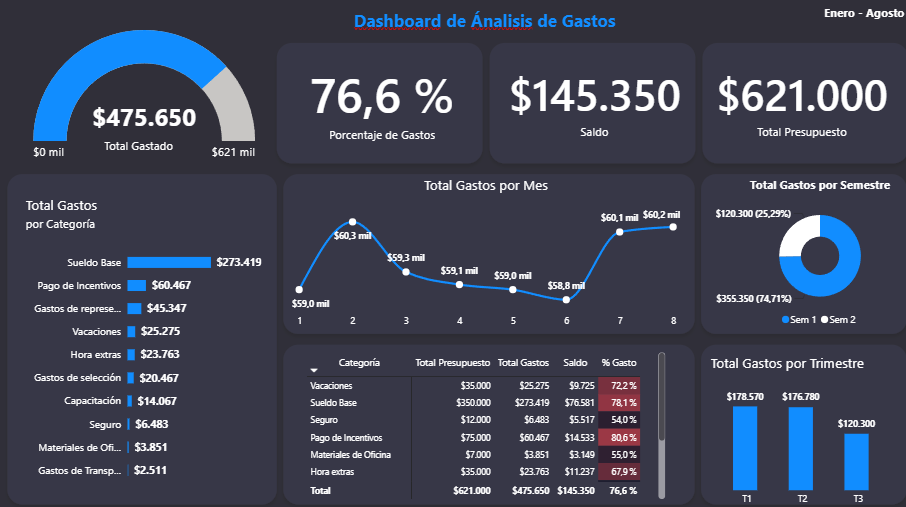

# Dashboard de Análisis de Gastos - Recursos Humanos

Este proyecto consiste en el desarrollo de un dashboard en Microsoft Power BI para analizar y monitorear los gastos realizados durante el período de **enero a agosto**.

El dashboard está diseñado para facilitar la toma de decisiones basada en datos, permitiendo comparar el presupuesto asignado con los gastos realizados y el saldo disponible.

---

## Indicadores y visualizaciones del dashboard

El dashboard fue construido considerando los siguientes indicadores y visualizaciones:

### Indicadores

- Total Gastado
- % de Gasto
- Saldo
- Total Presupuesto

### Visualizaciones

- Gráfico de barras: Total gastado por categoría.
- Gráfico de líneas: Total gastado por mes.
- Matriz: Presupuesto, total gastado, saldo y porcentaje de gasto por categoría.
- Gráfico de anillos: Total gastado por semestre.
- Gráfico de columnas: Total gastado por trimestre.

---

## Estructura del dashboard

El dashboard presenta la información en diferentes secciones para facilitar su interpretación.

### 1. Indicadores principales

En la parte superior se muestran los principales indicadores del tiempo analizado:

| Indicador | Resultado |
|---|---:|
| Total Gastado | $475.650 |
| Porcentaje de Gastos | 76,6 % |
| Saldo | $145.350 |
| Total Presupuesto | $621.000 |

Estos indicadores permiten obtener rápidamente una visión general de la situación presupuestaria.

---

## Análisis de gastos por categoría

El gráfico de barras permite identificar las categorías que concentran la mayor cantidad de gastos.

Entre las categorías mostradas se encuentran:

- Sueldo Base
- Pago de Incentivos
- Gastos de recreación
- Vacaciones
- Hora extras
- Gastos de selección
- Capacitación
- Seguro
- Materiales de Oficina
- Gastos de Transporte

La visualización facilita detectar rápidamente qué categoría representa una mayor proporción del gasto total.

En este caso, Sueldo Base representa la categoría con mayor gasto dentro del dashboard.

---

## Análisis mensual

El gráfico de líneas muestra la evolución del **de los gastos por mes** durante el período de enero a agosto.

En base con el dashboard, los gastos presentan variaciones durante el período.

---

## Análisis por semestre

El gráfico de anillos divide los gastos entre:

- **Semestre 1:** $355.350 (74,71 %)
- **Semestre 2:** $120.300 (25,29 %)

Esto permite observar que la mayor parte del gasto registrado corresponde al primer semestre del período analizado.

---

## Análisis por trimestre

El gráfico de columnas permite comparar el gasto acumulado por trimestre:

| Trimestre | Total Gastado |
|---|---:|
| T1 | $178.570 |
| T2 | $176.780 |
| T3 | $120.300 |

Esta visualización ayuda a determinar en qué trimestre se concentró el mayor nivel de gasto.

---

## Matriz de análisis

La matriz permite realizar un análisis más detallado por categoría mediante las siguientes métricas:

- Categoría
- Total Presupuesto
- Total Gastos
- Saldo
- % Gasto

Esto permite comparar cuánto presupuesto fue asignado a cada categoría frente al gasto realmente ejecutado.

---

## Herramientas utilizadas

- **Microsoft Power BI**
- **DAX** creación de medidas.
- **Modelado de datos** analizar la información.
- **Visualizaciones** nativas de Power BI.

---

### Creación de medidas

Se crean medidas para obtener indicadores como:

- Total Presupuesto
- Total Gastado
- Saldo
- Porcentaje de Gasto


```DAX
Total Gastos = SUM(Gastos1[Gastos]) 

Total Presupuesto = SUM(Presupuesto2[Presupuesto Anual])

Saldo = [Total Presupuesto]-[Total Gastos]

% Gasto = DIVIDE([Total Gastos],[Total Presupuesto],0)
```
---

## Principales resultados

A partir del dashboard se pueden destacar los siguientes resultados:

- El presupuesto total es de **$621.000**.
- El gasto alcanza **$475.650**.
- Se ha usado aproximadamente el **76,6 % del presupuesto**.
- Existe un saldo disponible de **$145.350**.
- **Sueldo Base** es la categoría con mayor nivel de gasto.
- El **primer semestre concentra la mayor parte del gasto registrado**.
- El análisis trimestral permite observar diferencias importantes en la distribución del gasto.

---
## Vista previa

### Dashboard principal




## Cómo utilizar el proyecto

1. Instalar **Microsoft Power BI Desktop**.
2. Clonar o descargar este repositorio.
3. Abrir el archivo `.pbix`.
4. Revisar el modelo de datos y las medidas.
5. Utilizar los filtros y visualizaciones del dashboard para explorar la información.

---